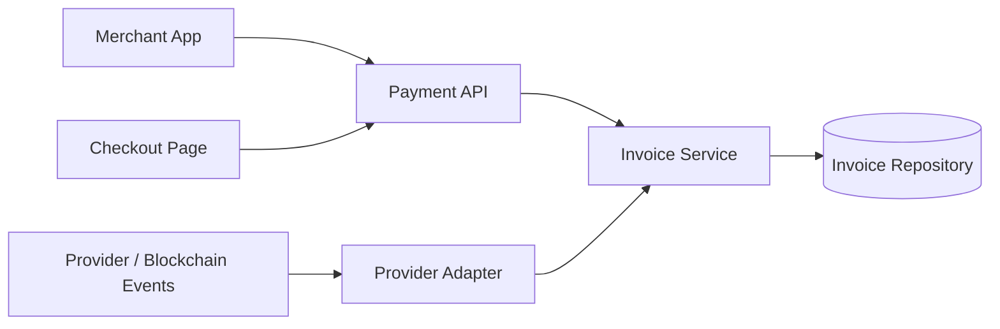

# ZyraPayments API

Public engineering case study for the payment API behind a crypto payments platform. The production service manages invoice creation, payment status, merchant-facing integration, provider updates, and the lifecycle of customer checkout payments.

This repository is intentionally sanitized. It shows API contracts, state-machine thinking, idempotency decisions, tests, and production concerns without exposing private keys, merchant secrets, or blockchain provider integrations.

## Problem

Payment APIs must be predictable under retries, late provider events, network failures, and customer-facing timeouts. A merchant can retry invoice creation. A provider can send the same event twice. A webhook can arrive after an invoice has already expired.

The core challenge is to keep invoice state correct while allowing external systems to be unreliable.

## Solution

The API models payments as an explicit invoice lifecycle:

- invoice creation is idempotent;
- payment status is represented as a state machine;
- terminal states are protected from late updates;
- provider adapters are isolated from lifecycle rules;
- webhooks and polling converge into the same transition layer.

## Key Features

- Merchant-facing invoice creation.
- Idempotency key requirement for safe retries.
- Invoice state machine for status transitions.
- OpenAPI contract for integration.
- Provider adapter boundary.
- Unit tests for lifecycle edge cases.
- Production notes for webhook safety and reconciliation.

## Architecture



The state machine is the center of the design. Routes, webhooks, polling jobs, and reconciliation tools should all use the same transition logic.

## Tech Stack

- Node.js, Express, TypeScript.
- MySQL in the production implementation.
- OpenAPI for merchant-facing contracts.
- Vitest for lifecycle tests.
- GitHub Actions for CI.

## Engineering Highlights

- `docs/adr/0001-invoice-state-machine.md` explains why invoice status is modeled as a state machine.
- `docs/adr/0002-idempotent-invoice-creation.md` covers safe merchant retries.
- `docs/openapi.yaml` documents the public-safe API contract.
- `examples/invoice-state/invoiceState.ts` demonstrates terminal-state protection.
- `tests/invoiceState.test.ts` covers valid transitions, terminal states, and invalid events.
- `docs/production.md` covers webhook verification, event deduplication, reconciliation, and observability.

## Production Considerations

Payment infrastructure has a low tolerance for ambiguity. The private production system must account for:

- duplicate provider events;
- delayed confirmations;
- merchant retries;
- invoice expiration races;
- API key scoping;
- webhook signature verification;
- auditability around state changes.

## Public vs Private

Included in this repository:

- invoice lifecycle example;
- OpenAPI contract;
- tests and CI;
- ADRs;
- production and roadmap docs.

Excluded from this repository:

- webhook signing implementation;
- merchant secrets;
- private keys and seed phrases;
- RPC credentials;
- real database schemas;
- production logs;
- provider adapters.

## Local Development

```bash
npm install
npm run typecheck
npm test
```
