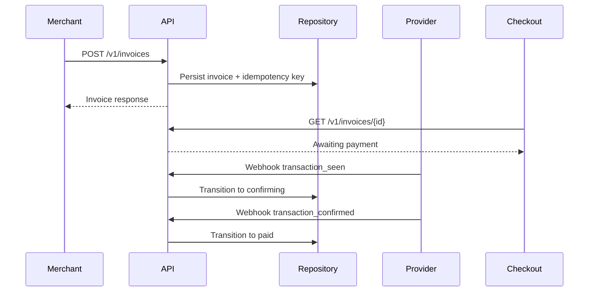

# Architecture

```text
HTTP Routes -> Invoice Service -> Repository
                  |
                  v
            Provider Adapter
                  |
                  v
          Webhook/Polling Updates
```

## Notes

- The API models invoices as a lifecycle with explicit transitions.
- Provider-specific logic is isolated behind adapters.
- Routes stay thin and delegate validation/business rules to services.
- Webhook and polling updates converge into the same state transition layer.

## Sequence: Invoice Payment


